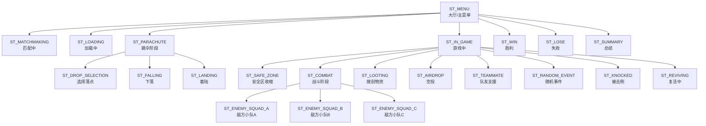
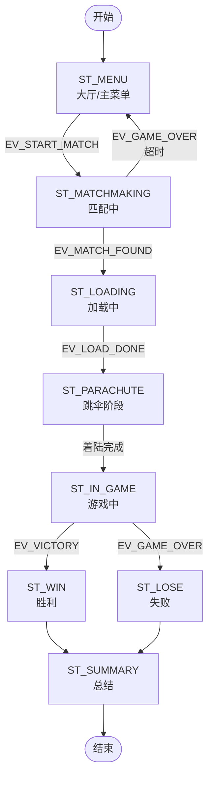
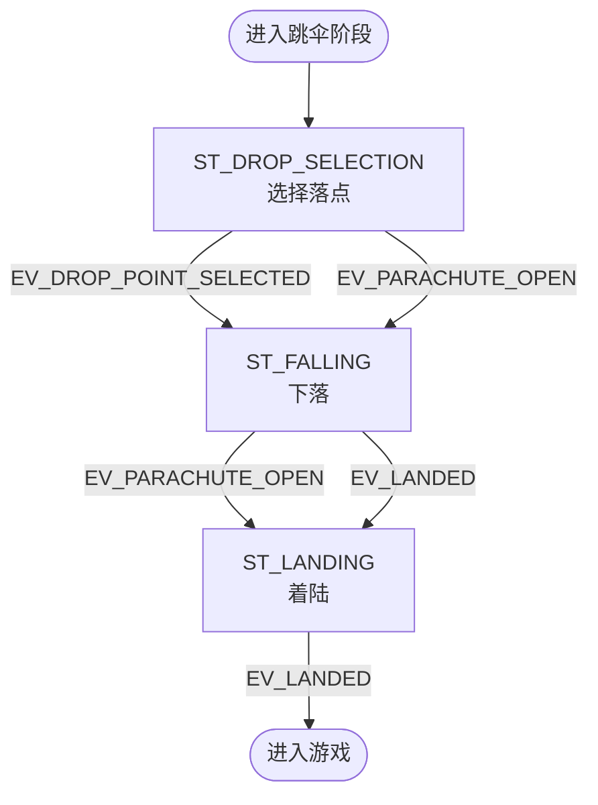
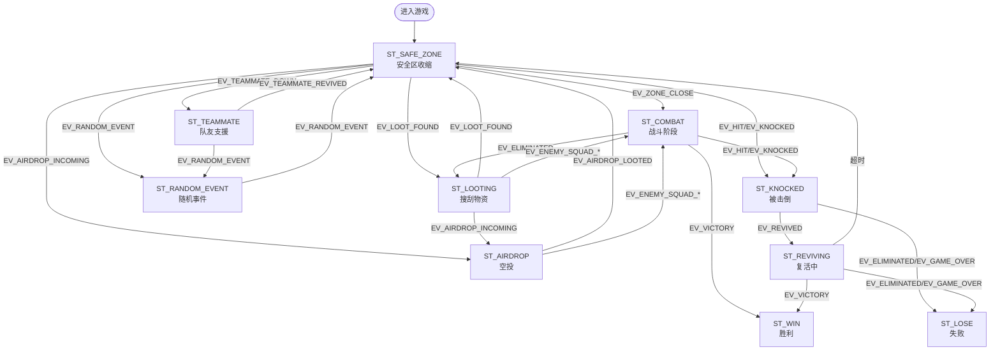
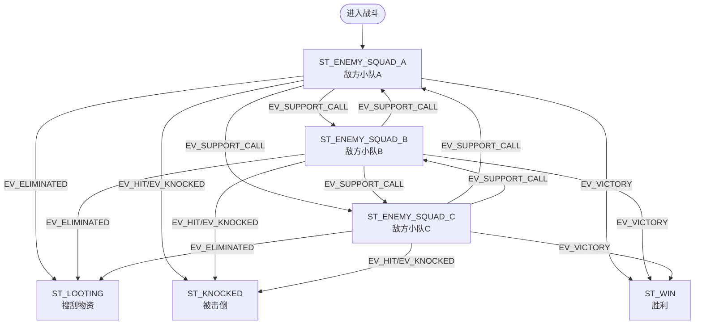
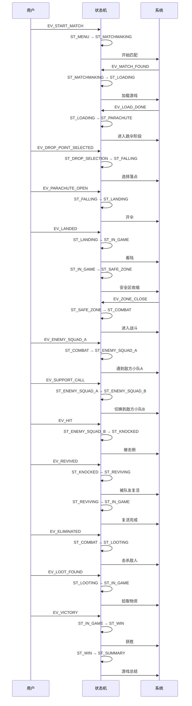
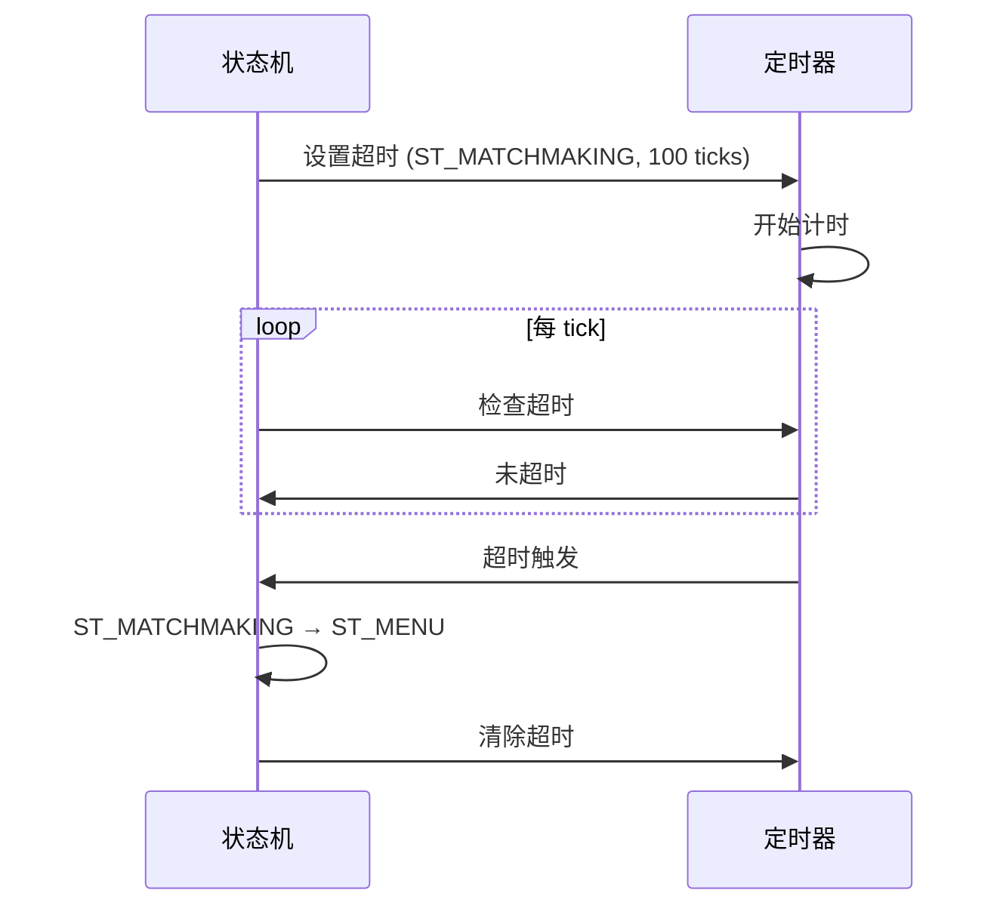
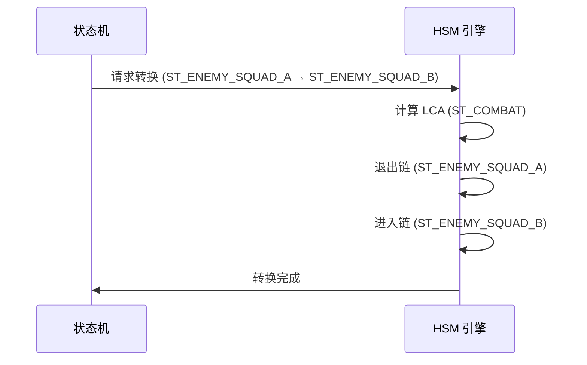

# PUBG FSM 设计文档

## 1. 概述

本文档描述了"和平精英"游戏场景的有限状态机（FSM）设计。该 FSM 模拟了从大厅到匹配、加载、跳伞、战斗、胜利/失败的完整游戏流程。

### 1.1 设计目标

- 模拟典型射击游戏的核心流程
- 展示 FSM 的状态、事件、超时等功能
- 使用 HSM（层次化状态机）实现状态层级
- 支持事件驱动的状态转换

### 1.2 技术栈

- 语言：C
- 框架：通用有限状态机框架（fsm.c/fsm.h）
- 特性：HSM、事件队列、超时、回调、统计、轨迹

---

## 2. 状态定义

### 2.1 状态枚举

```c
typedef enum
{
    /* 根状态 */
    ST_MENU = 0,        /* 大厅 / 主菜单 */
    ST_MATCHMAKING,     /* 匹配中 */
    ST_LOADING,         /* 加载中 */

    /* 跳伞阶段（HSM 父状态） */
    ST_PARACHUTE,       /* 跳伞阶段（父状态） */
    ST_DROP_SELECTION,  /* - 子状态：选择落点 */
    ST_FALLING,         /* - 子状态：下落 */
    ST_LANDING,         /* - 子状态：着陆 */

    /* 游戏内阶段（HSM 父状态） */
    ST_IN_GAME,         /* 进入游戏 */
    ST_SAFE_ZONE,       /* - 子状态：安全区收缩 */
    ST_COMBAT,          /* - 父状态：战斗阶段 */
    ST_ENEMY_SQUAD_A,   /*   - 子状态：遇到敌方小队 A */
    ST_ENEMY_SQUAD_B,   /*   - 子状态：遇到敌方小队 B */
    ST_ENEMY_SQUAD_C,   /*   - 子状态：遇到敌方小队 C */

    ST_LOOTING,         /* 搜刮物资 */
    ST_AIRDROP,         /* 空投 */
    ST_TEAMMATE,        /* 队友支援 */
    ST_RANDOM_EVENT,    /* 随机事件 */
    ST_KNOCKED,         /* 被击倒 */
    ST_REVIVING,        /* 复活中 */
    ST_WIN,             /* 胜利 */
    ST_LOSE,            /* 失败 */
    ST_SUMMARY,         /* 总结 */
    ST_COUNT
} pubg_state_t;
```

### 2.2 状态说明

| 状态 | 说明 | 父状态 |
|------|------|--------|
| ST_MENU | 大厅/主菜单 | FSM_HSM_NO_PARENT |
| ST_MATCHMAKING | 匹配中 | ST_MENU |
| ST_LOADING | 加载中 | ST_MENU |
| ST_PARACHUTE | 跳伞阶段 | ST_MENU |
| ST_DROP_SELECTION | 选择落点 | ST_PARACHUTE |
| ST_FALLING | 下落 | ST_PARACHUTE |
| ST_LANDING | 着陆 | ST_PARACHUTE |
| ST_IN_GAME | 游戏中 | ST_MENU |
| ST_SAFE_ZONE | 安全区收缩 | ST_IN_GAME |
| ST_COMBAT | 战斗阶段 | ST_IN_GAME |
| ST_ENEMY_SQUAD_A | 遇到敌方小队 A | ST_COMBAT |
| ST_ENEMY_SQUAD_B | 遇到敌方小队 B | ST_COMBAT |
| ST_ENEMY_SQUAD_C | 遇到敌方小队 C | ST_COMBAT |
| ST_LOOTING | 搜刮物资 | ST_IN_GAME |
| ST_AIRDROP | 空投 | ST_IN_GAME |
| ST_TEAMMATE | 队友支援 | ST_IN_GAME |
| ST_RANDOM_EVENT | 随机事件 | ST_IN_GAME |
| ST_KNOCKED | 被击倒 | ST_IN_GAME |
| ST_REVIVING | 复活中 | ST_IN_GAME |
| ST_WIN | 胜利 | ST_MENU |
| ST_LOSE | 失败 | ST_MENU |
| ST_SUMMARY | 总结 | ST_MENU |

---

## 3. 事件定义

### 3.1 事件列表

| 事件 | 值 | 说明 |
|------|-----|------|
| EV_START_MATCH | 0x01 | 发起匹配 |
| EV_MATCH_FOUND | 0x02 | 匹配成功 |
| EV_LOAD_DONE | 0x03 | 加载完成 |
| EV_DROP_POINT_SELECTED | 0x04 | 选择落点 |
| EV_PARACHUTE_OPEN | 0x05 | 开伞 |
| EV_LANDED | 0x06 | 着陆 |
| EV_ZONE_CLOSE | 0x07 | 安全区收缩完成 |
| EV_ENEMY_SQUAD_A | 0x08 | 遇到敌方小队 A |
| EV_ENEMY_SQUAD_B | 0x09 | 遇到敌方小队 B |
| EV_ENEMY_SQUAD_C | 0x0A | 遇到敌方小队 C |
| EV_SUPPORT_CALL | 0x0B | 请求支援（切换目标） |
| EV_HIT | 0x0C | 受伤 |
| EV_KNOCKED | 0x0D | 被击倒 |
| EV_REVIVED | 0x0E | 被队友复活 |
| EV_ELIMINATED | 0x0F | 击杀敌人 |
| EV_VICTORY | 0x10 | 获胜 |
| EV_GAME_OVER | 0x11 | 游戏结束 |
| EV_EXIT_GAME | 0x12 | 退出游戏 |
| EV_LOOT_FOUND | 0x13 | 发现物资 |
| EV_AIRDROP_INCOMING | 0x14 | 空投到达 |
| EV_AIRDROP_LOOTED | 0x15 | 拾取空投 |
| EV_TEAMMATE_DOWN | 0x16 | 队友倒地 |
| EV_TEAMMATE_REVIVED | 0x17 | 队友复活 |
| EV_RANDOM_EVENT | 0x18 | 随机事件触发 |

---

## 4. 状态机图

### 4.1 整体状态机图

```mermaid
stateDiagram-v2
    [*] --> ST_MENU

    ST_MENU --> ST_MATCHMAKING : EV_START_MATCH
    ST_MATCHMAKING --> ST_LOADING : EV_MATCH_FOUND
    ST_MATCHMAKING --> ST_MENU : EV_GAME_OVER (超时)
    ST_LOADING --> ST_PARACHUTE : EV_LOAD_DONE

    state ST_PARACHUTE {
        [*] --> ST_DROP_SELECTION
        ST_DROP_SELECTION --> ST_FALLING : EV_DROP_POINT_SELECTED
        ST_DROP_SELECTION --> ST_FALLING : EV_PARACHUTE_OPEN
        ST_FALLING --> ST_LANDING : EV_PARACHUTE_OPEN
        ST_FALLING --> ST_LANDING : EV_LANDED
        ST_LANDING --> [*] : EV_LANDED
    }

    ST_PARACHUTE --> ST_IN_GAME : 着陆完成

    state ST_IN_GAME {
        [*] --> ST_SAFE_ZONE
        ST_SAFE_ZONE --> ST_COMBAT : EV_ZONE_CLOSE
        ST_SAFE_ZONE --> ST_LOOTING : EV_LOOT_FOUND
        ST_SAFE_ZONE --> ST_AIRDROP : EV_AIRDROP_INCOMING
        ST_SAFE_ZONE --> ST_TEAMMATE : EV_TEAMMATE_DOWN
        ST_SAFE_ZONE --> ST_RANDOM_EVENT : EV_RANDOM_EVENT
        ST_SAFE_ZONE --> ST_KNOCKED : EV_HIT/EV_KNOCKED

        state ST_COMBAT {
            [*] --> ST_ENEMY_SQUAD_A
            ST_ENEMY_SQUAD_A --> ST_ENEMY_SQUAD_B : EV_SUPPORT_CALL
            ST_ENEMY_SQUAD_A --> ST_ENEMY_SQUAD_C : EV_SUPPORT_CALL
            ST_ENEMY_SQUAD_B --> ST_ENEMY_SQUAD_A : EV_SUPPORT_CALL
            ST_ENEMY_SQUAD_B --> ST_ENEMY_SQUAD_C : EV_SUPPORT_CALL
            ST_ENEMY_SQUAD_C --> ST_ENEMY_SQUAD_A : EV_SUPPORT_CALL
            ST_ENEMY_SQUAD_C --> ST_ENEMY_SQUAD_B : EV_SUPPORT_CALL
        }

        ST_COMBAT --> ST_LOOTING : EV_ELIMINATED
        ST_COMBAT --> ST_KNOCKED : EV_HIT/EV_KNOCKED
        ST_COMBAT --> ST_WIN : EV_VICTORY

        ST_LOOTING --> ST_IN_GAME : EV_LOOT_FOUND
        ST_LOOTING --> ST_AIRDROP : EV_AIRDROP_INCOMING
        ST_LOOTING --> ST_COMBAT : EV_ENEMY_SQUAD_*

        ST_AIRDROP --> ST_IN_GAME : EV_AIRDROP_LOOTED
        ST_AIRDROP --> ST_COMBAT : EV_ENEMY_SQUAD_*

        ST_TEAMMATE --> ST_IN_GAME : EV_TEAMMATE_REVIVED
        ST_TEAMMATE --> ST_RANDOM_EVENT : EV_RANDOM_EVENT

        ST_RANDOM_EVENT --> ST_IN_GAME : EV_RANDOM_EVENT

        ST_KNOCKED --> ST_REVIVING : EV_REVIVED
        ST_KNOCKED --> ST_LOSE : EV_ELIMINATED/EV_GAME_OVER

        ST_REVIVING --> ST_IN_GAME : 超时
        ST_REVIVING --> ST_WIN : EV_VICTORY
        ST_REVIVING --> ST_LOSE : EV_ELIMINATED/EV_GAME_OVER
    }

    ST_IN_GAME --> ST_WIN : EV_VICTORY
    ST_IN_GAME --> ST_LOSE : EV_GAME_OVER

    ST_WIN --> ST_SUMMARY : 自动
    ST_LOSE --> ST_SUMMARY : 自动
    ST_SUMMARY --> ST_SUMMARY : 保持
```

### 4.2 HSM 层级结构图



---

## 5. 流程图

### 5.1 主流程图



### 5.2 跳伞阶段流程图



### 5.3 游戏内阶段流程图



### 5.4 战斗阶段流程图



---

## 6. 时序图

### 6.1 完整游戏流程时序图



### 6.2 超时处理时序图



### 6.3 HSM 转换时序图



---

## 7. 关键逻辑说明

### 7.1 状态转换规则

1. **自转换**：目标状态等于当前状态时，始终允许，不触发回调
2. **HSM 转换继承**：如果当前状态没有定义转换，会沿父链向上查找
3. **超时转换**：超时触发时，会自动执行转换，无需事件触发

### 7.2 事件处理优先级

1. **超时检查**：在 `fsm_step()` 开头检查
2. **事件处理**：在 handler 中处理当前事件
3. **状态转换**：根据 handler 返回值执行转换

### 7.3 HSM 回调顺序

1. **退出链**：从当前状态到 LCA（不含 LCA），bottom-up
2. **进入链**：从 LCA 下一层到目标状态，top-down
3. **回调触发**：在转换时同步触发，不是延迟到下一次 `fsm_step()`

### 7.4 用户数据管理

```c
typedef struct
{
    uint32_t tick_count;          /* 经过的 tick 数（模拟时间） */
    uint32_t kills;               /* 已击杀敌人数 */
    uint32_t team_kills;          /* 队友击杀数 */
    uint32_t teammates_alive;     /* 仍存活的队友数 */
    uint32_t enemy_squads;        /* 遭遇的敌方小队数 */
    uint32_t loot_count;          /* 当前持有物资数量 */
    bool     safe_zone_active;    /* 是否处于安全区阶段 */
    bool     airdrop_active;      /* 是否有空投可拾取 */
    bool     random_event_active; /* 是否处于随机事件中 */
    bool     in_combat;           /* 是否正在战斗中 */
    bool     knocked_down;        /* 是否被击倒 */
    bool     parachute_opened;    /* 是否已开伞 */
    bool     drop_point_selected; /* 是否已选择落点 */
    bool     landed;              /* 是否已着陆 */
    uint8_t  target_squad;        /* 目标敌方小队：1=A，2=B，3=C，0=无 */
} pubg_user_data_t;
```

### 7.5 超时配置

| 状态 | 超时 ticks | 目标状态 | 说明 |
|------|------------|----------|------|
| ST_MATCHMAKING | 100 | ST_MENU | 匹配超时返回大厅 |
| ST_LOADING | 50 | ST_IN_GAME | 加载超时进入游戏 |
| ST_IN_GAME | 80 | ST_SAFE_ZONE | 安全区倒计时 |
| ST_KNOCKED | 40 | ST_LOSE | 被击倒超时失败 |
| ST_SAFE_ZONE | 60 | ST_IN_GAME | 安全区结束 |
| ST_LOOTING | 30 | ST_IN_GAME | 搜刮超时 |
| ST_AIRDROP | 40 | ST_IN_GAME | 空投超时 |
| ST_RANDOM_EVENT | 50 | ST_IN_GAME | 随机事件超时 |
| ST_REVIVING | 30 | ST_IN_GAME | 复活超时 |

---

## 8. 测试场景

### 8.1 完整游戏流程

```
1. 开始匹配 (ST_MENU → ST_MATCHMAKING)
2. 匹配成功 (ST_MATCHMAKING → ST_LOADING)
3. 加载完成 (ST_LOADING → ST_PARACHUTE)
4. 选择落点 (ST_DROP_SELECTION → ST_FALLING)
5. 开伞 (ST_FALLING → ST_LANDING)
6. 着陆 (ST_LANDING → ST_IN_GAME)
7. 安全区收缩 (ST_IN_GAME → ST_SAFE_ZONE)
8. 安全区结束 (ST_SAFE_ZONE → ST_IN_GAME)
9. 遇到敌人小队A (ST_IN_GAME → ST_COMBAT → ST_ENEMY_SQUAD_A)
10. 请求支援 (ST_ENEMY_SQUAD_A → ST_ENEMY_SQUAD_B)
11. 再次支援 (ST_ENEMY_SQUAD_B → ST_ENEMY_SQUAD_C)
12. 被击中 (ST_ENEMY_SQUAD_C → ST_KNOCKED)
13. 被队友复活 (ST_KNOCKED → ST_REVIVING)
14. 复活完成 (ST_REVIVING → ST_IN_GAME)
15. 击杀敌人 (ST_COMBAT → ST_LOOTING)
16. 拾取物资 (ST_LOOTING → ST_IN_GAME)
17. 空投来临 (ST_IN_GAME → ST_AIRDROP)
18. 空投拾取 (ST_AIRDROP → ST_IN_GAME)
19. 队友倒地 (ST_IN_GAME → ST_TEAMMATE)
20. 队友复活 (ST_TEAMMATE → ST_IN_GAME)
21. 随机事件触发 (ST_IN_GAME → ST_RANDOM_EVENT)
22. 随机事件结束 (ST_RANDOM_EVENT → ST_IN_GAME)
23. 胜利 (ST_IN_GAME → ST_WIN)
24. 总结 (ST_WIN → ST_SUMMARY)
```

---

## 9. 性能考虑

### 9.1 内存占用

- 基础字段：6B
- handlers[8]：32B
- transitions[8][8]：256B
- callbacks：8B
- debug：6B
- timeout：50B
- event queue：12B
- stats[8]：128B
- trace[16]：64B
- HSM parent[8]：8B
- HSM cbs_fired：1B
- user_data：4B
- **总计：约 575B**（全特性 + HSM，FSM_MAX_STATES=8，32 位平台）

### 9.2 时间复杂度

- 状态转换：O(1)
- HSM 转换：O(depth)，depth 为状态层级深度
- 超时检查：O(1)
- 事件处理：O(1)

---

## 10. 扩展性

### 10.1 添加新状态

1. 在 `pubg_state_t` 枚举中添加新状态
2. 在 `PUBGM_STATE_NAMES` 数组中添加状态名
3. 实现对应的 handler 函数
4. 注册 handler：`fsm_register_handler()`
5. 设置父状态：`fsm_hsm_set_parent()`
6. 添加转换：`fsm_add_transition()`
7. （可选）添加超时：`fsm_add_timeout()`

### 10.2 添加新事件

1. 在 `pubg_fsm.h` 中定义新事件
2. 在相关 handler 中处理新事件
3. 添加对应的转换规则

### 10.3 添加新功能

1. **新回调**：使用 `fsm_set_callbacks()` 设置
2. **新统计**：使用 `fsm_get_stats()` 获取
3. **新轨迹**：使用 `fsm_get_trace()` 获取

---

## 11. 已知问题

### 11.1 tick_count 未更新

**问题**：在 `handler_random_event()` 中使用了 `ud->tick_count % 3U`，但 `tick_count` 从未被更新。

**影响**：随机事件将始终执行 case 0（切换 safe_zone_active），case 1 和 case 2 永远不会执行。

**修复**：在 `advance_ticks()` 函数中添加 `g_pubg_data.tick_count++`。

---

## 12. 参考资料

- [fsm.h](fsm.h) - FSM 框架头文件
- [fsm.c](fsm.c) - FSM 框架实现
- [pubg_fsm.h](pubg_fsm.h) - PUBG FSM 头文件
- [pubg_fsm.c](pubg_fsm.c) - PUBG FSM 实现
- [AGENTS.md](AGENTS.md) - 项目指南
